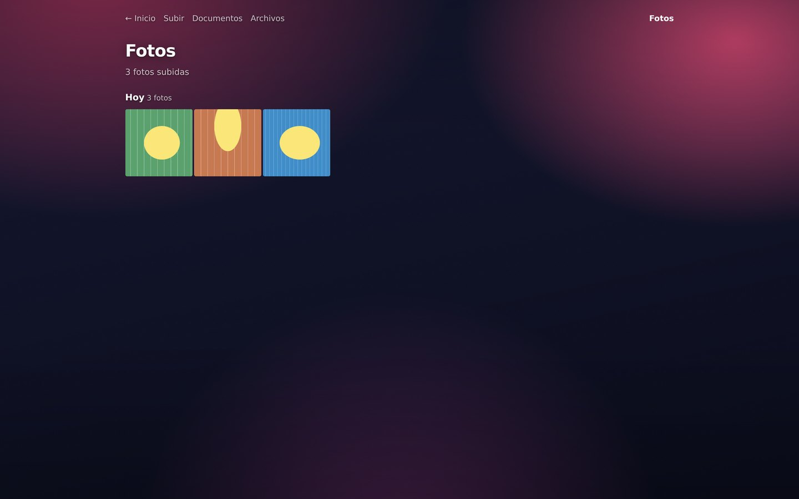
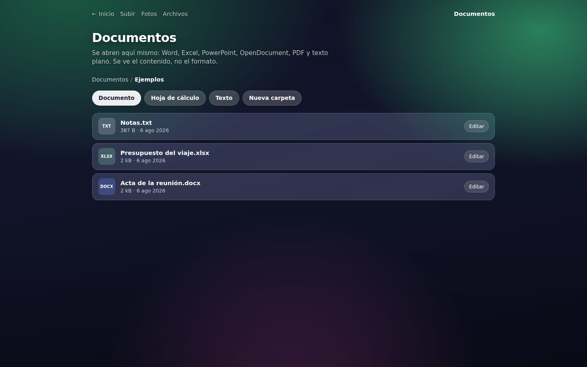
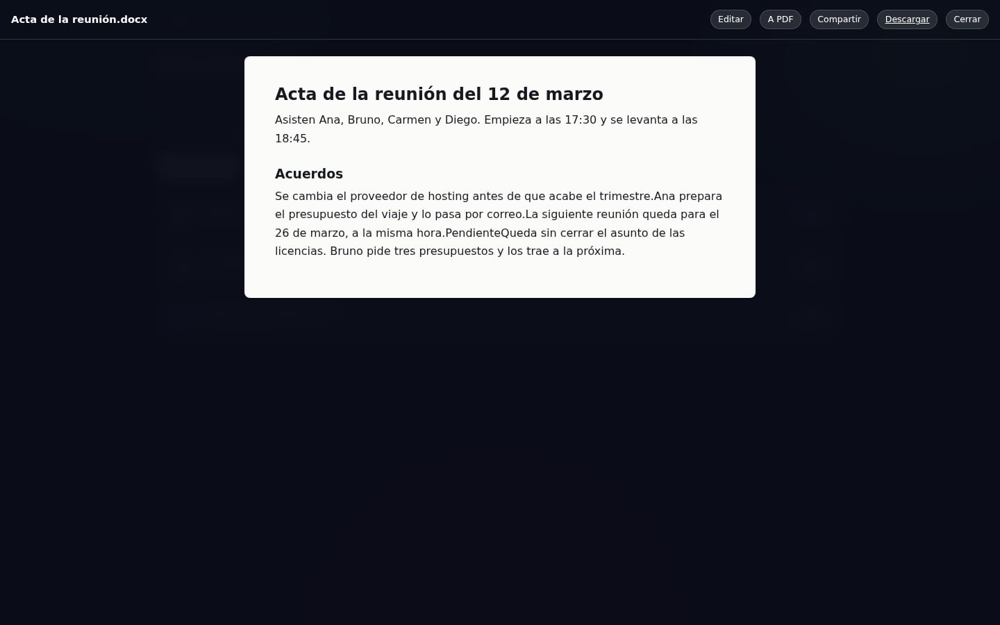
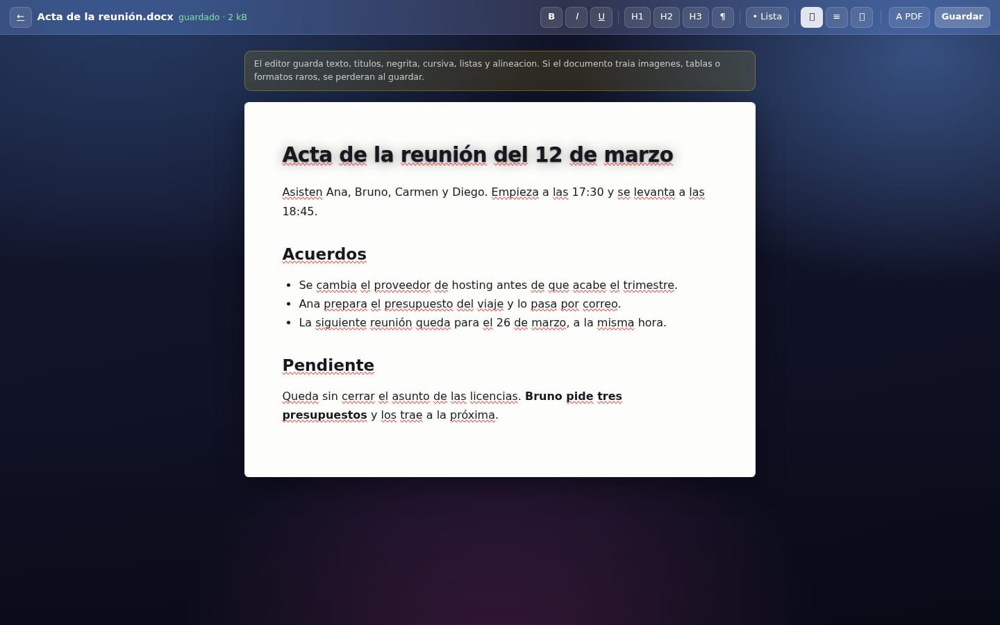
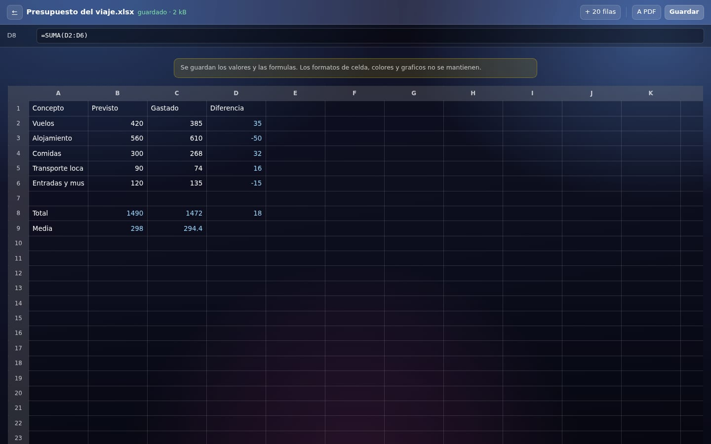
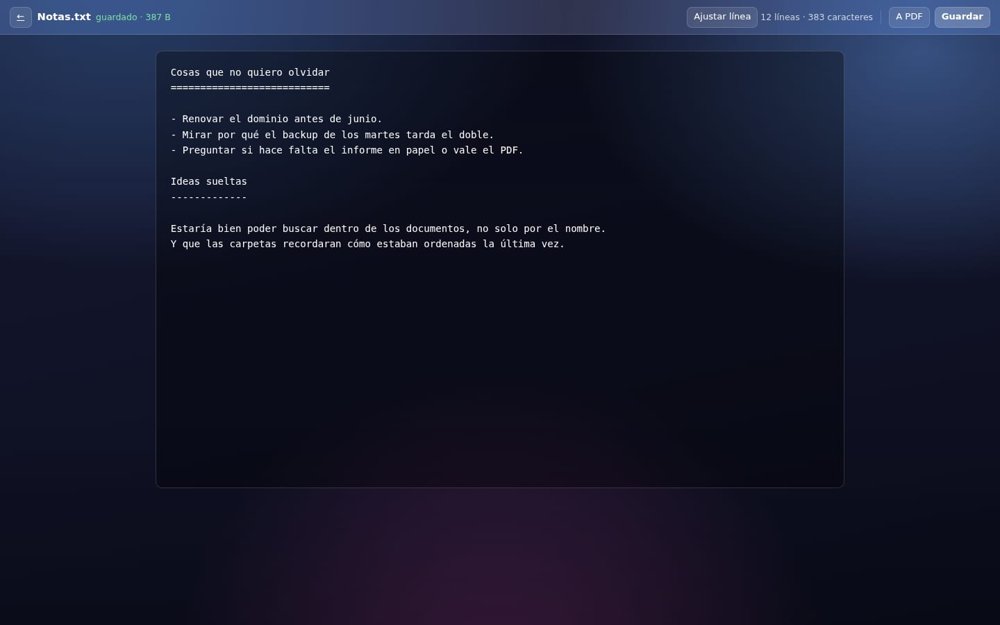
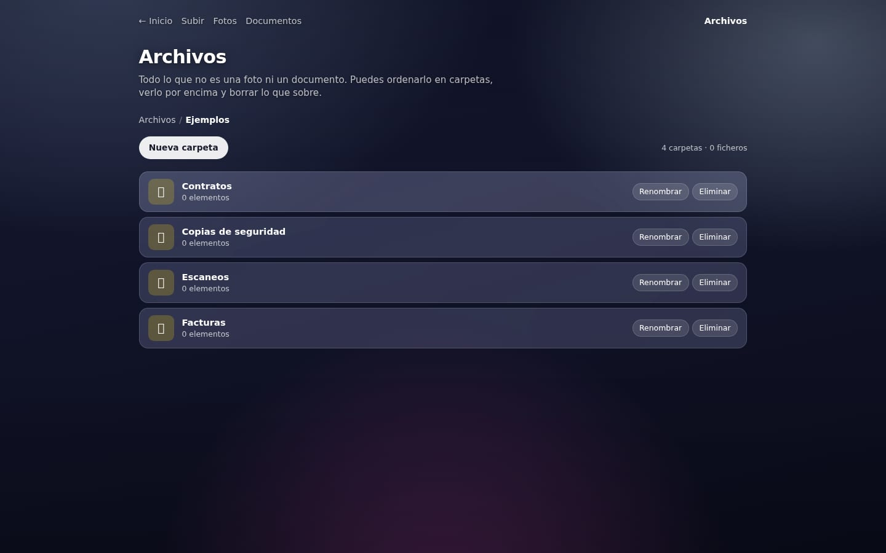
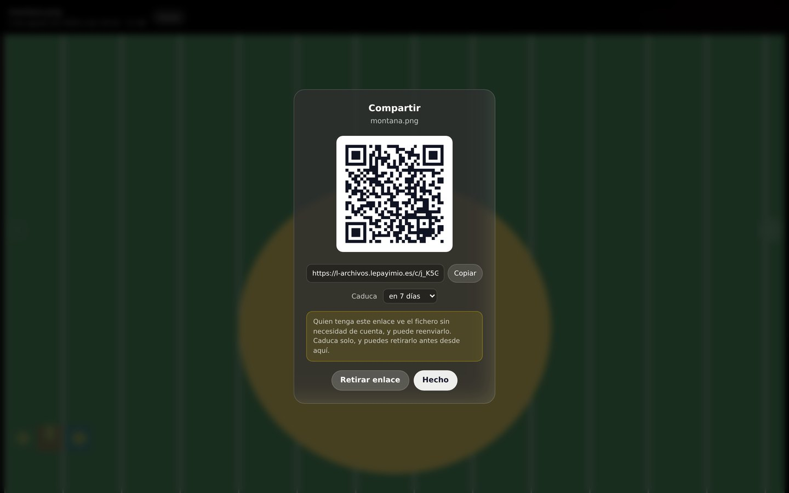
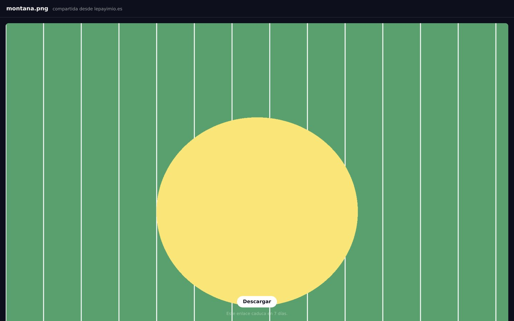
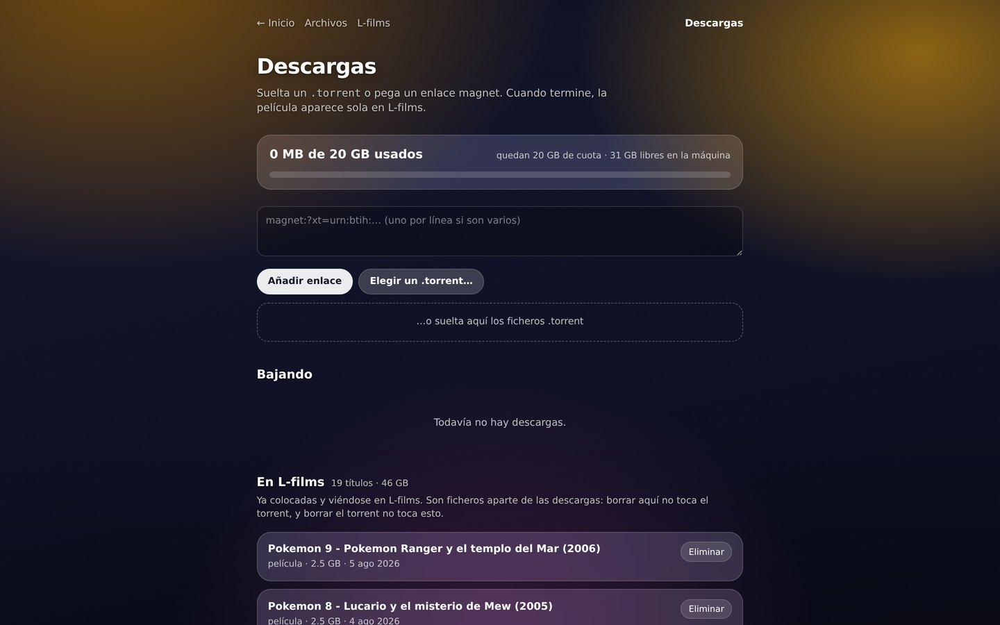

# L-archivos

La puerta de entrada de ficheros de [lepayimio.es](https://lepayimio.es). Es el
único sitio desde el que entran cosas al servidor por navegador: subiendo un
fichero o metiendo un torrent.

Según lo que sea, lo deja donde toca y se aparta:

| Lo que entra | Dónde acaba |
|---|---|
| Película o serie | `/var/media/entrada`, que vigila el buzón de L-films y coloca en Jellyfin |
| Imagen | `/var/archivos/imagenes` |
| Documento | `/var/archivos/documentos` |
| Cualquier otra cosa | `/var/archivos/otros` |

Parte de la familia de [lepayimio](https://github.com/pelayodesantiago98-ctrl):
comparte con el resto la sesión del portal, el aspecto y el buzón de vídeo.


## Cómo se ve

Cada sección lleva el color con el que el portal pinta su icono, de modo que se
sabe dónde estás antes de leer el título.

### Fotos



Cuadrados pegados, agrupados por día, con visor a pantalla completa que se pasa
con las flechas o deslizando el dedo. Las miniaturas se generan una vez y se
guardan: de 325 kB a 3 kB por foto, que es lo que hace que la rejilla se abra en
un móvil. Los HEIC del iPhone entran igual.

### Documentos





Word, Excel, PowerPoint, OpenDocument, PDF y texto plano, abiertos aquí mismo
sin LibreOffice: todos esos formatos son un ZIP con XML dentro, así que se saca
el contenido y se pinta. Se pierde el formato y se queda el texto, las tablas y
la estructura.

### Escribir y editar







Los tres se crean desde Documentos y se abren en la misma pantalla, que se
adapta a lo que sea: un folio con títulos, negrita, listas y alineación; una
rejilla con referencias, barra de fórmula y SUMA, PROMEDIO, MIN, MAX y CONTAR;
o texto plano con tabulador de verdad y cuenta de líneas.

De la hoja se guarda **la fórmula, no el número**. El resultado se calcula aquí
para verlo al momento, pero si guardáramos ese y Excel no estuviera de acuerdo,
ganaría el nuestro y la hoja mentiría.

Cualquiera de los tres —y además .doc, .xls, .ppt, .odt, .rtf y .csv— sale a PDF
con el botón de arriba. Eso sí lo hace LibreOffice sin pantalla, que es la única
forma honrada de que el PDF se parezca al documento.

Antes de guardar encima de un .docx ajeno, avisa: al guardar se rehace el
fichero entero, así que las imágenes, las tablas y los formatos que no sabe
mantener se perderían.

### Archivos



Todo lo demás, en carpetas: crearlas, renombrar, previsualizar y borrar.
Los documentos se crean en Documentos; aquí se editan y se pasan a PDF igual.

### Compartir con QR



Cualquier foto, documento o fichero se puede enseñar a alguien de fuera con un
enlace y su código QR. El código son 16 bytes aleatorios en base64url —22
caracteres— así que probar a ciegas no es una vía, y caduca solo salvo que se
pida indefinido.



Quien lo abre ve ese fichero y nada más: ni el listado, ni la carpeta, ni los de
al lado. La ruta sale del almacén interno, nunca de la petición. Y la página se
adapta a lo que sea: imagen, vídeo, PDF o texto se ven ahí mismo; de lo demás
solo se ofrece la descarga.

### Descargas



La barra de la cuota tiene dos cuerpos: lo que ya está en el disco y lo que
ocupará cuando terminen las descargas a medias. Sin esa distinción, una descarga
al 5 % parece gratis y luego falta cuota sin saber por qué.

### Favoritos


Viven detrás del botón de la esquina, no en la página: son diecinueve títulos
que empujaban hacia abajo lo que se viene a hacer aquí, que es mirar las
descargas.

Lo que se marca desaparece de la lista desde la que se borra, y el servidor
**se niega a borrarlo**: devuelve 409 pidiendo que lo quites de favoritos
primero. Las dos cosas, no solo la primera — esconder el botón evita el
despiste, pero la petición se puede lanzar igual desde una pestaña vieja donde
esa película todavía salía con su botón, y 3 GB sin papelera no tienen deshacer.

Se añaden desde un desplegable que solo lista las que aún no lo son, y se quitan
con el botón de al lado.

---

## Por qué la subida va a trozos

El dominio está detrás de Cloudflare con la nube en naranja, y el plan gratuito
corta cualquier cuerpo que pase de 100 MB. Una película son gigas, así que no
puede subir de una tacada: el navegador la parte y manda trozos de 16 MB que el
servidor va añadiendo al final del mismo fichero.

Salió de una limitación, pero es mejor que lo de antes: cada trozo se confirma
por separado, así que una subida de 4 GB que se corte al 80 % se reanuda desde
donde iba en vez de empezar de cero. El progreso no se guarda en memoria — es el
tamaño del propio fichero a medias —, así que también sobrevive a un reinicio
del servicio.

## Descargas por torrent

Se suelta un `.torrent` o se pega un enlace magnet, y cuando termina la película
aparece sola en L-films. Por debajo hay un `transmission-daemon` que solo
escucha en `127.0.0.1` y con clave.

Al terminar, el vídeo se pone en el buzón de L-films con un **enlace duro**, no
con una copia: el fichero aparece en dos sitios pero ocupa disco una sola vez.
Con 20 GB de cuota y un disco compartido con la biblioteca, copiar cada película
dos veces no es una opción.

Y en cuanto está, **el torrent se retira solo** con sus datos, dejando la cuota
libre para el siguiente. Suena a que se pierde la descarga y no: un fichero no
se borra de verdad hasta que no queda ningún enlace apuntándole, así que al
quitar el del torrent los bytes siguen vivos en el buzón esperando a que los
recoja. Es la misma razón por la que se enlaza en vez de copiar. A cambio, deja
de compartirse.

### El tope de 20 GB

Se mide contra lo **comprometido** — lo que ocupará cuando todo termine —, no
contra lo que ya está bajado. Midiéndolo contra lo bajado se aceptarían cinco
películas de 4 GB «porque ahora mismo caben» y el disco reventaría a mitad de
camino. Además exige dejar un margen libre en la máquina: que quepa en la cuota
no significa que quepa en el disco.

### Dos cosas que no son evidentes

**Un magnet no se puede añadir en pausa.** Son cuarenta bytes con un hash: el
tamaño hay que pedírselo al enjambre, y para hablar con el enjambre hay que
estar en marcha. Añadirlo pausado para comprobar la cuota antes de soltarlo lo
deja en pausa para siempre. Un `.torrent` sí trae los metadatos dentro y ahí el
truco funciona. Por eso el magnet entra andando y hay un vigilante que para lo
que se pase de cuota en cuanto se sabe el tamaño.

**`ProtectSystem=strict` con `ReadWritePaths` rompe los enlaces duros.** systemd
monta cada ruta en un *namespace* propio y `ln` entre dos montajes distintos da
`EXDEV` aunque debajo haya un solo disco. Eso hacía que cada película se copiara
en vez de enlazarse. La unidad usa `ProtectSystem=full`.

## Borrar

Las descargas y lo que ya está en L-films son ficheros distintos, porque el
buzón no mueve lo que llega: lo pasa por ffmpeg y escribe uno nuevo. Por eso se
sueltan por separado, y la página lo dice en cada confirmación. Borrar una
descarga libera cuota; borrar una película libera disco.

## Cómo corre

Node y Express, sin base de datos. La sesión es la del portal, compartida por
todos los sitios del dominio y verificada con el módulo común
`/usr/local/lib/lepayimio/sso`. El servicio va como `www-data` con el resto de
candados de systemd, y nginx delante pone la CSP y las cabeceras.

```
npm ci
node server.js      # PORT=3005 por defecto
```

Hace falta un `.env` con `PORT` y la ruta del RPC de transmission, y que exista
`/etc/lepayimio/transmission.env` con sus credenciales. Ninguno de los dos está
en el repositorio, por razones evidentes.

## Licencia

GPL-3.0. Ver [LICENSE](LICENSE).
